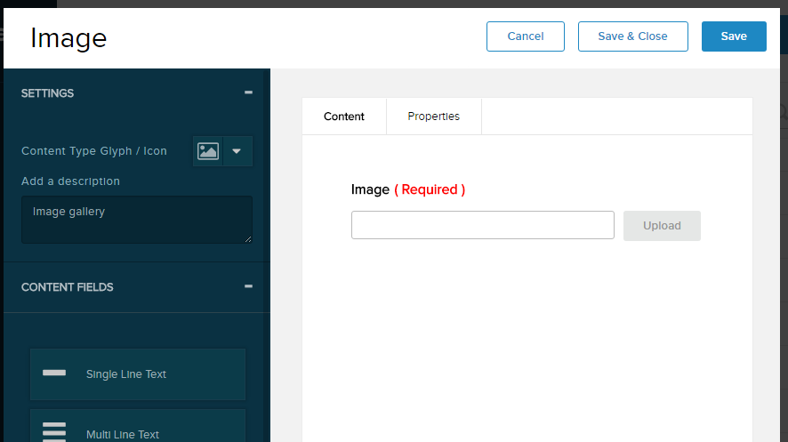
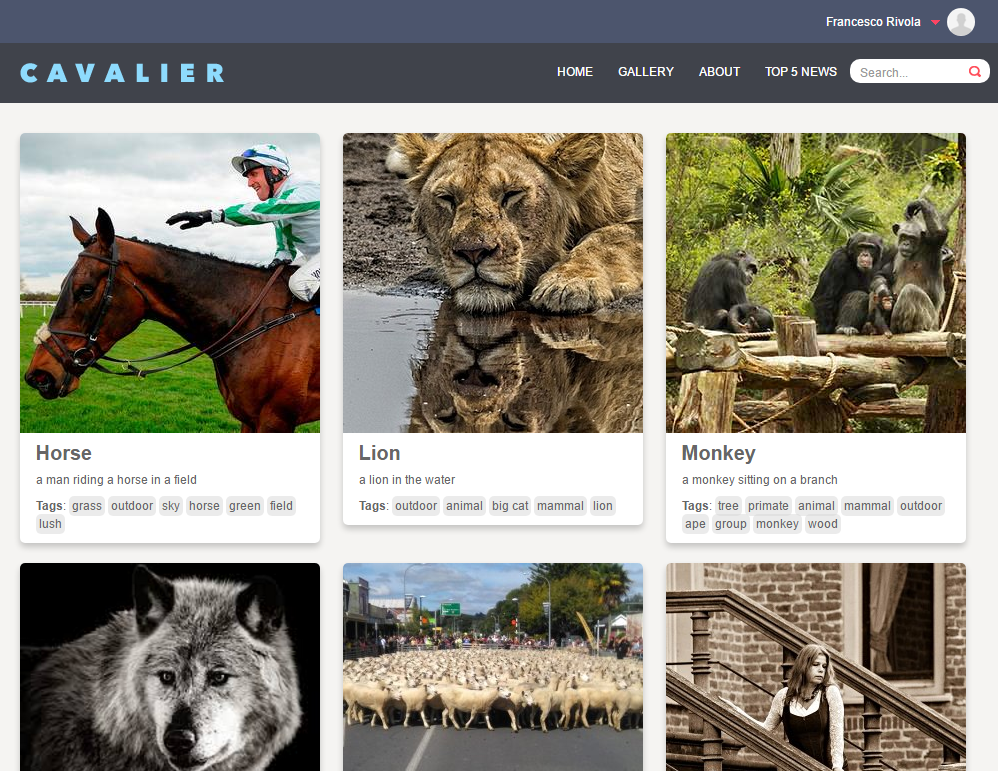
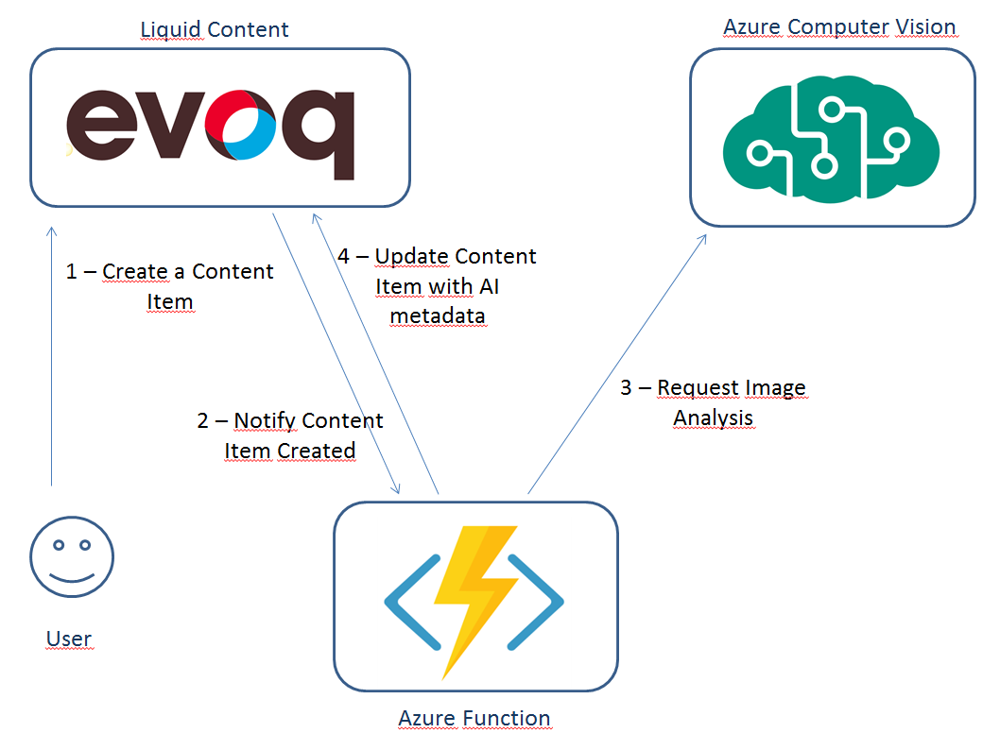
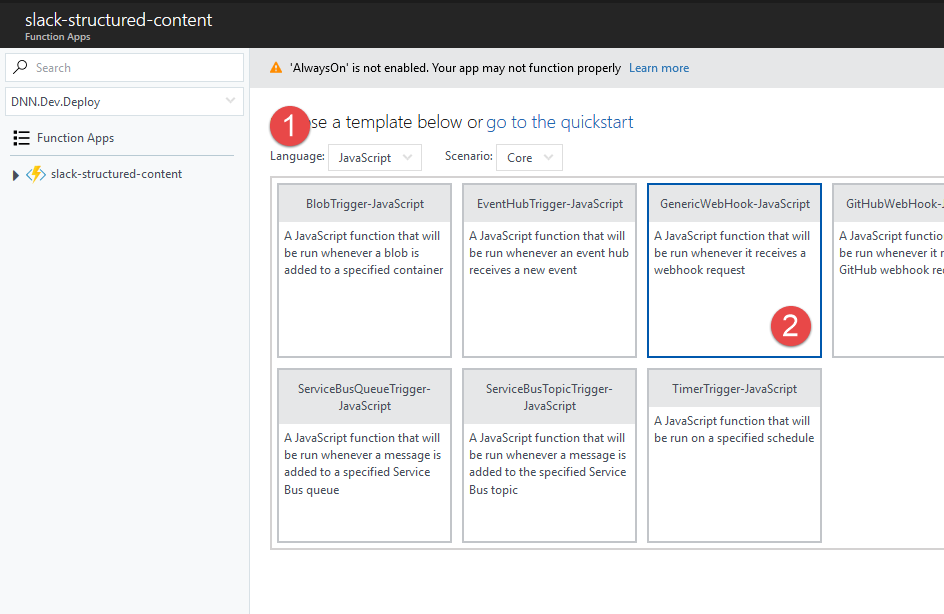
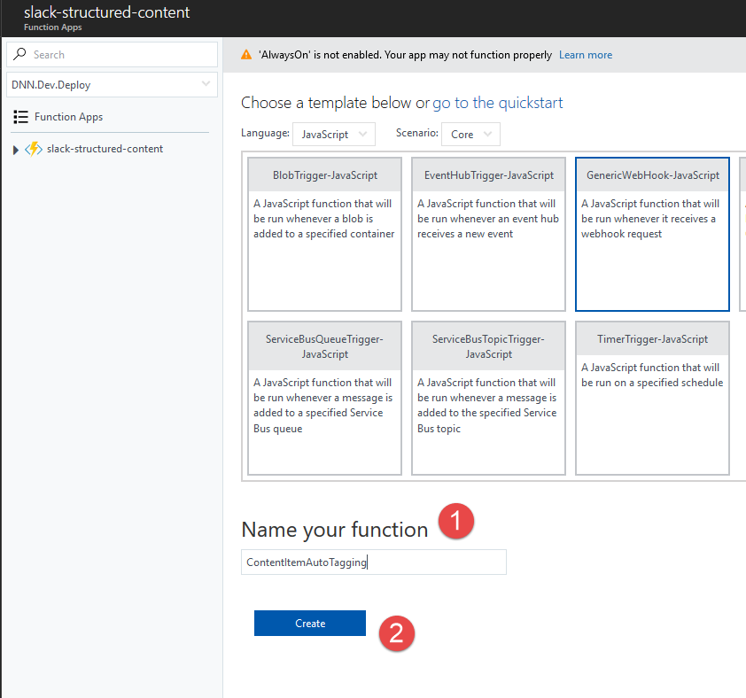
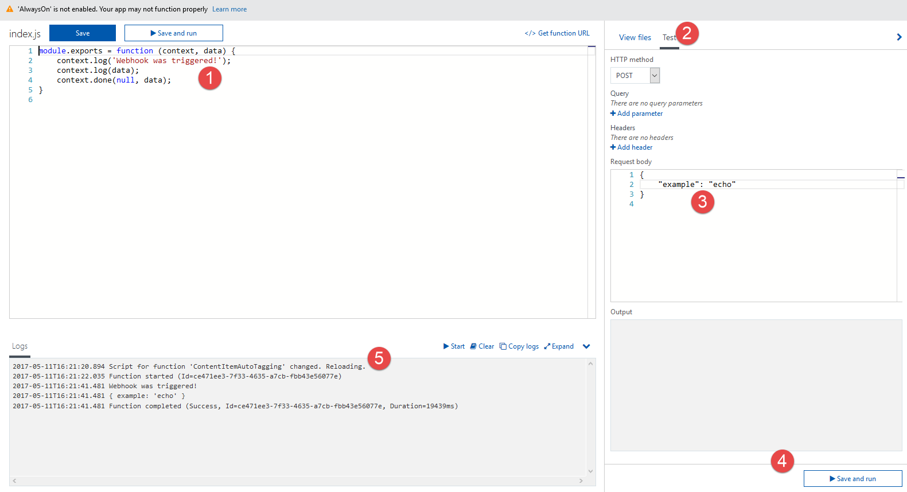
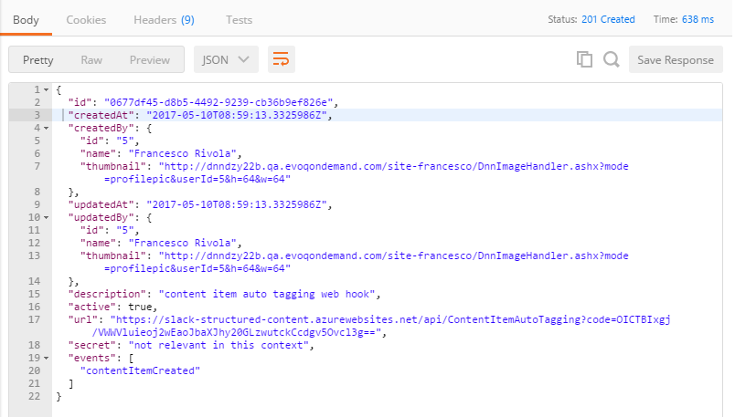
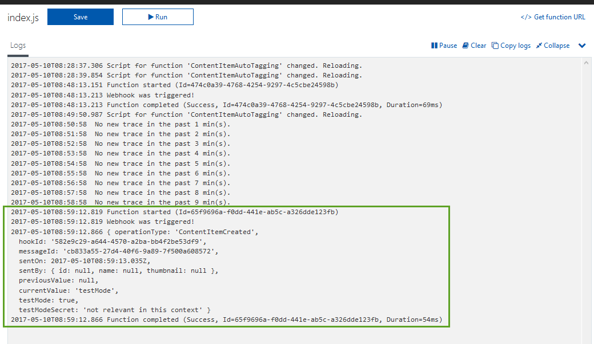
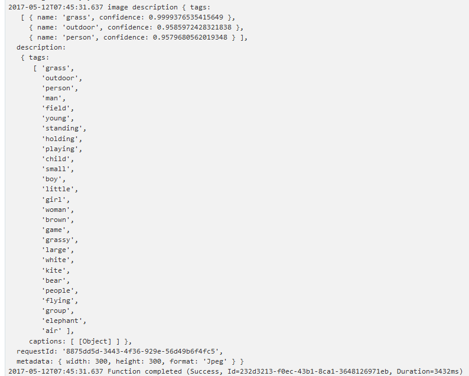
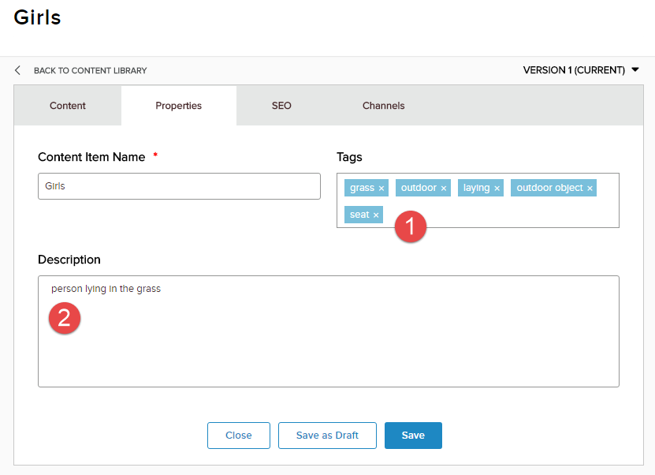

# Liquid Content – Content Item Auto Tagging

# Introduction

Liquid Content provides a great API to integrate with other applications and system. This tutorial will teach you how to bring Computer Vision and Artificial Intelligence to your Liquid Content.


## Business use case

As Content Manager of a big company with content generated daily, I want to improve the process of content item tagging and description taking benefit of the today technologies in Artificial Intelligence and Artificial Vision.

**The goal** of our project is to automate the **creation of tags and description** for your Content Items on creation.


## Content Type

In this example we have a Content Type called **Image** that has a main field Image that stores the main asset of the Content Item.

Any Content Type has by default a Seo Settings fields as Tags and Description fields.




The Image content items could be used anywhere, for example as a gallary in a public page of your web site. There we show the description and tags for each image (see image below).




## Architecture

Liquid Content provides two way API:

1. PULL information: create or read data on demand via http api
2. PUSH information: it allows you to subscribe to a one or more events and receive a **Web Hook** notification via http.

To achive our goal we will structure our application in the following 4 steps: 

1. subscribe to the Content Item Creation Event of Content Items of the specific Image Content Type
2. when notified we will read the content item, get the main image url field
3. we will send the image url to Azure Computer Vision API to get tags and caption information
4. finally we will update the content item adding tags and description fields 



# Prerequisites

- Basic knowledge of js and nodejs
- MS Azure Account

# Technologies

The following technologies are going to be used in this tutorial:

1. Javascript on NodeJs (ECMA6)
2. Azure Function (see https://azure.microsoft.com/en-us/services/functions/)
3. Azure Computer Vision API (see https://azure.microsoft.com/es-es/services/cognitive-services/computer-vision/)
4. Web Hooks


# Step 1 – Create Subscriber - Azure Function Http Trigger

Let's start to have fun now!!

The first step of our tutorial will be **create our subscriber to the Content Item Creation Event**. 
In order to registeron on this event we need a public URL that will receive an Http Post request any time a content item is created. For this project we have used Azure Function, but you are free to use any other technology you are familiar with to expose a web api endpoint (this is the great benefit of working with http apis as those that are technology agnostic).


## 1.1 Create your Azure Function Http Trigger

Go to the Azure portal and after you have created an Azure function account, creates a function selecting the "Generic Web Hook Javascript" template (see image below)



Then pickup a cool name and click the Create button



Once you have done you will see your function showed in the portal like the image below. If this is what you see, then congratulation, you have created your Web Hook Subscriber!!!


## 1.2 – Test the Subscriber

Once created the http web hook the next step is to test it and ensure it is working properly. 

First of all we will simplify the code to just perform a simple echo, returning a 200 http success response with the same data is sent as incoming payload.

Now change the content of the index.js to a very basic code that peform an echo

```
module.exports = function (context, data) {
    context.log('Webhook was triggered!');
    context.log(data);
    context.done(null, data);
}    
```

Hit the Save button and now let's test it. If everything is setup fine you will be able to see in the log window the echo response!




# Step 2 – Register the Subscribe to Liquid Content

Liquid Content exposes an API to subscribe web hooks (as the one created above). All what you need is to provide the following information to the API:

1. URL of the web hook
2. Description
3. Events you want subscribe to


## 2.1 - Check Azure Function Url

See below how to get the url of your azure function:


## 2.2 - Perform Http API call to subscribe to Liquid Content

Registration is one time operation that need to be done via an http request. See image below:

**End Point**

POST https://dnnapi.com/content/api/webhooks

**Header**
```
Content-Type: application/json
Authorization: Bearer {YOUR TOKEN}
```

**Body**
```
{
	"description": "content item auto tagging web hook",
	"url": "https://slack-structured-content.azurewebsites.net/api/ContentItemAutoTagging?code=OICTBIxgj/VWWVluieoj2wEaoJbaXJhy20GLzwutckCcdgv5Ovcl3g==",
	"active": true,
	"secret": "not relevant in this context",
	"events": [
		"ContentItemCreated"
	]
}
```

Once you perform the request if everything goes well you will see the following http response:



Also, if you inspect your azure function log you will see that Liquid Content has performed an http post call to the url provided in the payload to verify that this url is valid and can be called successfully.



**Great!!! You Rocks!!!**: now any time a Content Item is created in Liquid Content your azure function will be called sending you basic information about the created Content Item.

**Important Note**
To be able to call the Web Hook api you will need to inspect and get the token in the network developer tool tab when visit Liquid Content Persona Bar panel as Admin or Host user. The token created via API KEY does not allow yet to use Web Hook API.


# Step 3 – Implement Auto Tagging integration

Now everything is configured let's start to create our awesome app!!


## 3.1 - Get Content Item Id and Content Type Id

The information we first need to retrieve from the web hook payload are:

1. Content Item Id: to be able to retrieve the content item information and then update it
2. Content Type Id: to be able to ignore any content item that are not of type Image

So add the below code at the top of the echo code.

```
const contentTypeId = data.currentValue.contentTypeId;
const contentItemId = data.currentValue.id;
const imageContentTypeId = '15797409-d0e0-4e99-b4bb-3440caca7f72';

// Ignore content item creation than are not Image Content Type
if(contentTypeId !== imageContentTypeId) {
    context.done(null, {});
    return;
}
```


## 3.2 - Create Content Item Service

Now that we have control over the type of Content Item we process, next step will be build a Content Item service javascript module responsible to read and update a content item given its identifier.

For that we will use API Key and the Content Item API. Also we will use the **npm request** package to perform http calls (see instruction to how install npm packages in azure function here https://docs.microsoft.com/en-us/azure/azure-functions/functions-reference-node#node-version-and-package-management).

So, let's add a new file called contentItemsService.js in the azure function project and create two very simple methods getContentItem and updateContentItem. 

```
const request = require('request');
const apiKey = 'b9214fb8c937dc5e4ffde2d706aaa8ea';

function getContentItem(contentItemId) {
    const options = {
        method: 'GET',
        url: 'https://dnnapi.com/content/api/contentitems/' + contentItemId,
        headers: {
            'Authorization': 'Bearer ' + apiKey
        }
    };
    return new Promise((resolve, reject) => {
        request(options, function(error, response, body){
            if(error) {
                reject(error);
                return;
            }
            const jsonBody = JSON.parse(body);
            resolve(jsonBody);
        });
    });
}

function updateContentItem(contentItem) {
    const options = {
        method: 'PUT',
        url: 'https://dnnapi.com/content/api/contentitems/' + contentItem.id + '?publish=true',
        body: JSON.stringify(contentItem),
        headers: {
            'Content-type': 'application/json',
            'Authorization': 'Bearer ' + apiKey
        }
    };
    return new Promise((resolve, reject) => {
        request(options, function(error, response, body){
            if(error) {
                reject(error);
                return;
            }
            const jsonBody = JSON.parse(body);
            resolve(jsonBody);
        });
    });
}

const contentItemsService = {
    getContentItem,
    updateContentItem
};
module.exports = contentItemsService;
```


## 3.3 - Use ContentItemsService

Now that we have created the service let's import it in the index.js adding the code below at the top of the file.

```
const contentItemsService = require('./contentItemsService');
```

After the check to ignore no Image Content Items, add the following code and remove the echo code

```
let contentItemToUpdate = null;

contentItemsService.getContentItem(contentItemId)
    .then(contentItem => {
        context.log('content item', contentItem);
        contentItemToUpdate = contentItem;
        if(!contentItem.details.image || contentItem.details.image.length === 0) {
            context.log('no image to process');
            context.done(null, {});
            return;
        }
        const imageUrl = contentItem.details.image[0].url;        
        context.log('content item image', imageUrl);
        context.done(null, {});
    })
    .catch(error => {
        context.log(error);
        context.done(null, { status: 500 });
    });
```

The final result should look like this

```
const contentItemsService = require('./contentItemsService');

module.exports = function (context, data) {
    context.log('Webhook was triggered!');
    context.log(data);

    const contentTypeId = data.currentValue.contentTypeId;
    const contentItemId = data.currentValue.id;
    const imageContentTypeId = '15797409-d0e0-4e99-b4bb-3440caca7f72';

    // Ignore content item creation than are not Image Content Type
    if(contentTypeId !== imageContentTypeId) {
        context.done(null, {});
        return;
    }

    let contentItemToUpdate = null;

    contentItemsService.getContentItem(contentItemId)
        .then(contentItem => {
            context.log('content item', contentItem);
            contentItemToUpdate = contentItem;
            if(!contentItem.details.image || contentItem.details.image.length === 0) {
                context.log('no image to process');
                context.done(null, {});
                return;
            }
            const imageUrl = contentItem.details.image[0].url;        
            context.log('content item image', imageUrl);
            context.done(null, {});
        })
        .catch(error => {
            context.log(error);
            context.done(null, { status: 500 });
        });
}
```

The above code performs a call to the Liquid Content API and retrieves the content item. Then it inspects its details object and checks for its main image based on the name of the field we have created.

Hit the Save button. Now after you create a content item of type image, you will see your azure function log showing the image url.

**Important Notes**
- The name of the field will typically match the name of the field label using a lower camel case format
- We store the retrieved content item in the contentItemToUpdate variable. We will use this later to update it


## 3.4 - Add Computer Vision Service

At this point we have the **image url** we want process. Now it is time to put in place the Artificial Vision Intelligence. For this we are going to use Azure Computer Vision API (https://azure.microsoft.com/es-es/services/cognitive-services/computer-vision/).

Before start, let's ensure you create in your **azure portal** a **Computer Vision API** account (you can go with the free tier) and check the **Subscription KEY** to be able able to get accesso to this API (more info can be found here https://docs.microsoft.com/es-es/azure/cognitive-services/computer-vision/vision-api-how-to-topics/howtosubscribe).

Let's create a new Service, call it computerVisionService.js. Add this file in azure function and copy the content below:


```
const request = require('request');

const apiKey = 'ec50a1f261e14337b719b42db5c6804d';
const endPointUrl = 'https://westus.api.cognitive.microsoft.com/vision/v1.0/analyze?visualFeatures=Description,Tags';

function describeImage(imageUrl) {
    const payload = {
        url: imageUrl
    }    
    return new Promise((resolve, reject) => {        
        const options = {
            method: 'POST',
            url: endPointUrl,
            body: JSON.stringify(payload),
            headers: {
                'Content-type': 'application/json',
                'Ocp-Apim-Subscription-Key': apiKey
            }
        };
        request(options, function(error, response, body){
            if(error) {
                reject(error);
                return;
            }
            const jsonBody = JSON.parse(body);
            resolve(jsonBody);
        });
    });
}

const computerVisionService = {
    describeImage
};
module.exports = computerVisionService;
```

The code above is pretty simple. It just expose the **describeImage** method. This takes in input a imageUrl parameter and it performs an http request to the Azure Cognitive API using the Subscription KEY. If everything goes well it will return the json payload of the image analysis perfomed.


## 3.5 - Use Computer Vision Service

Next step is make use of the service created in the previous step. Given the image url we want display in the azure function log the result of the analysis. 

Go into our index.js, then import at the top of the file the new service:

```
const computerVisionService = require('./computerVisionService');
```

Then call the describeImage method once we get the image url from the Content Item:

```
contentItemsService.getContentItem(contentItemId)
    .then(contentItem => {
        context.log('content item', contentItem);
        contentItemToUpdate = contentItem;
        if(!contentItem.details.image || contentItem.details.image.length === 0) {
            context.log('no image to process');
            context.done(null, {});
            return;
        }
        const imageUrl = contentItem.details.image[0].url;
        return computerVisionService.describeImage(imageUrl); // Call here the describeImage method passing in input the image url
    })
    .then(imageDescription => {    
        context.log('image description', imageDescription);     
        context.done(null, {});
    })
    .catch(error => {
        context.log(error);
        context.done(null, { status: 500 });
    });
```

Now your final code should look like this:

```
const contentItemsService = require('./contentItemsService');
const computerVisionService = require('./computerVisionService');

module.exports = function (context, data) {
    context.log('Webhook was triggered!');
    context.log(data);

    const contentTypeId = data.currentValue.contentTypeId;
    const contentItemId = data.currentValue.id;
    const imageContentTypeId = '15797409-d0e0-4e99-b4bb-3440caca7f72';

    // Ignore content item creation than are not Image Content Type
    if(contentTypeId !== imageContentTypeId) {
        context.done(null, {});
        return;
    }

    let contentItemToUpdate = null;

    contentItemsService.getContentItem(contentItemId)
        .then(contentItem => {
            context.log('content item', contentItem);
            contentItemToUpdate = contentItem;
            if(!contentItem.details.image || contentItem.details.image.length === 0) {
                context.log('no image to process');
                context.done(null, {});
                return;
            }
            const imageUrl = contentItem.details.image[0].url;
            return computerVisionService.describeImage(imageUrl);
        })
        .then(imageDescription => {    
            context.log('image description', imageDescription);     
            context.done(null, {});
        })
        .catch(error => {
            context.log(error);
            context.done(null, { status: 500 });
        });
}
```

Great!! If you are on this step you are rewarded with awesome AI. Now create a content item of type image and in the azure function console log you should see the analysis of your image (see below):




## 3.6 - Update Content Item with Image Tags and Description

This is the last step of the tutorial. In the previous step we got the awesome analysis of our image. Now It is time to store this information back to our Liquid Content system. For this we will need to use the UpdateContentItem method we implemented at the very beginning in our Content Items Service. 

So, add now this glue code in your index.js:

```
.then(imageDescription => {    
    context.log('image description', imageDescription);     
    const tags = imageDescription.tags.map(t => t.name);          
    const description = imageDescription.description.captions.map(c => c.text).toString();
    contentItemToUpdate.tags = tags;
    contentItemToUpdate.description = description;
    contentItemToUpdate.seoSettings = Object.assign(contentItemToUpdate.seoSettings || {}, {
        description,
        keywords: tags
    });
    context.log('content item to update', contentItemToUpdate);
    return contentItemsService.updateContentItem(contentItemToUpdate);
})
.then(() => {
    context.log('auto tagging completed');
    context.done(null, {});
})
.catch(error => {
    context.log(error);
    context.done(null, { status: 500 });
});
```

Above we are processing the imageDescription extracting the list of tags and captions given by the Vision API. This information is then assigned to the **contentItemToUpdate** object. We set the **tags** and **description** field as also the **seoSettings** object, expanding it with **description** and **keywords**. Finally we call the **updateContentItem** method to update and publish the content item in Liquid Content.

The final result of your index.js will be:

```
const contentItemsService = require('./contentItemsService');
const computerVisionService = require('./computerVisionService');

module.exports = function (context, data) {
    context.log('Webhook was triggered!');
    context.log(data);

    const contentTypeId = data.currentValue.contentTypeId;
    const contentItemId = data.currentValue.id;

    // Hardcoded identifier of our Image Content Type (this will be different in your project)
    const imageContentTypeId = '15797409-d0e0-4e99-b4bb-3440caca7f72';

    // Ignore content item creation than are not Image Content Type
    if(contentTypeId !== imageContentTypeId) {
        context.done(null, {});
        return;
    }

    // Create variable to modify and update the content item to update once retrieved
    let contentItemToUpdate = null;

    // Retrive Content Item
    contentItemsService.getContentItem(contentItemId)
        .then(contentItem => {
            context.log('content item', contentItem);
            contentItemToUpdate = contentItem;
            if(!contentItem.details.image || contentItem.details.image.length === 0) {
                context.log('no image to process');
                context.done(null, {});
                return;
            }
            const imageUrl = contentItem.details.image[0].url;

            // Get Image description from the Vision API
            return computerVisionService.describeImage(imageUrl);
        })
        .then(imageDescription => {    
            context.log('image description', imageDescription);     
            const tags = imageDescription.tags.map(t => t.name);          
            const description = imageDescription.description.captions.map(c => c.text).toString();

            // Update the Content Item with the new metadata
            contentItemToUpdate.tags = tags;
            contentItemToUpdate.description = description;
            contentItemToUpdate.seoSettings = Object.assign(contentItemToUpdate.seoSettings || {}, {
                description,
                keywords: tags
            });
            context.log('content item to update', contentItemToUpdate);

            // Store the update and publish
            return contentItemsService.updateContentItem(contentItemToUpdate);
        })
        .then(() => {
            context.log('auto tagging completed');
            context.done(null, {});
        })
        .catch(error => {
            // Catch any error and return a http 500 response
            context.log(error);
            context.done(null, { status: 500 });
        });
}
```

Finally, create a content item with an image. After is created reload the page, open the Persona Bar > Content Library. Go to the created Content Item detail and inspect the Properties and Seo tab. There you should see your automagically tags and description :)



Enjoy your AI Integration!!!!
