# **Liquid Content API Explorer**

# Introduction

This is a desktop application targeted to developers to ease the usage of the [Liquid Content API](http://www.dnnsoftware.com/cms-features/about-liquid-content).

Developers can use it to view, test and debug the API in an interactive way.

To start using it, just an API Key obtained from Liquid Content in [DNN Evoq](http://www.dnnsoftware.com/products) is needed.

Features:

- Interactive API requests
  - UI to specify method, controllers, and parameters for the request
  - Editor for the JSON request payload, for POST/PUT requests
  - The Raw HTTP request can be inspected (can be used to debug, to compare against the request of your own app)
  - The JSON response can be inspected in a syntax colorized viewer
- Examples of usage of common API operations
- Code snippet generation of the selected request

The goal is to create an app similar to the tools that other companies offer aimed for developers to test their API. Examples:

- Facebook -   [https://developers.facebook.com/tools/explorer/](https://developers.facebook.com/tools/explorer/)
- Twitter - [https://dev.twitter.com/ads/tutorials/using-twurl](https://dev.twitter.com/ads/tutorials/using-twurl)

## Technologies used

This app has been built using the following technologies:

- Electron - [electron.atom.io](http://electron.atom.io) - Platform to create desktop apps using Javascript/CSS/HTML
- Typescript - [https://www.typescriptlang.org/](https://www.typescriptlang.org/) - Typed superset of Javascript
- React [https://facebook.github.io/react/](https://facebook.github.io/react/) - User Interface framework
- Material UI - [http://www.material-ui.com](http://www.material-ui.com) - React UI widgets following Material Design

# Getting started

To start the app, you'll need first to get the Liquid Content Samples code. You can clone it from the [Github repository](https://github.com/dnnsoftware/Dnn.Evoq.LiquidContent.Samples.Public). Providing you have [git](https://git-scm.com/) already installed, run the next command in your system's terminal:

```bash
git clone https://github.com/dnnsoftware/Dnn.Evoq.LiquidContent.Samples.Public
```

This app's code is in the APIExplorer directory, so change to it:
```bash
cd APIExplorer
```

In order to build and run the app, you also need the [yarn](https://yarnpkg.com/) package manager. It can be downloaded and installed from [here](https://yarnpkg.com/lang/en/docs/install/). Once installed, execute the following commands to start the app:

```bash
# Install dependencies
yarn install
# Run the app
yarn start
```
These commands will automatically fetch all the required dependencies, and then will build and start the app. Once they finish, the main app UI wil open:

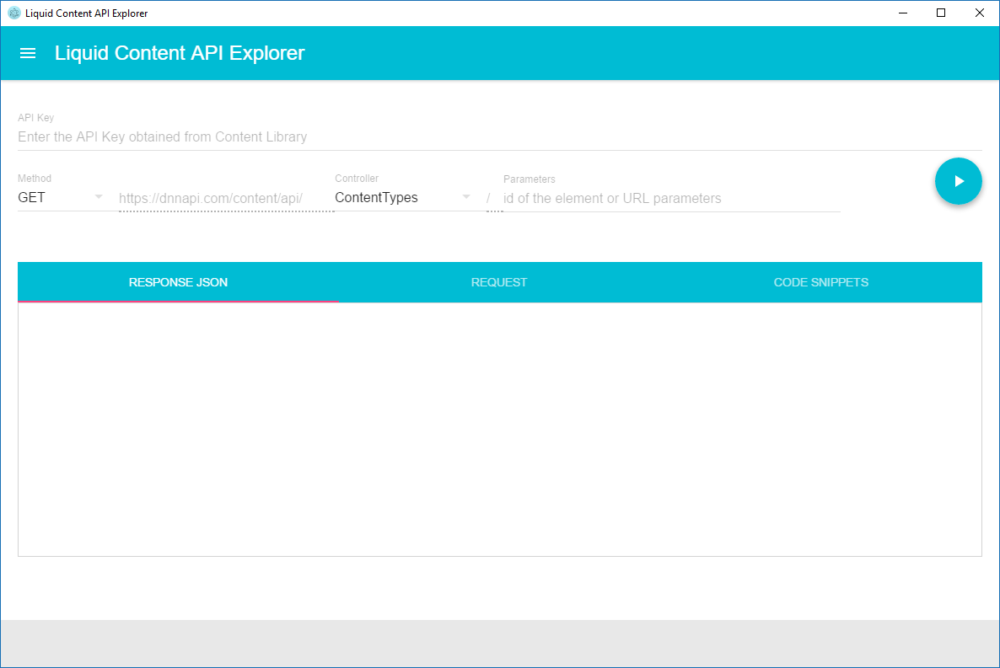

# Obtain an API Key

To start using the app, an API key is needed from Evoq. For the following use case we will be using a key with Read/Write permissions to the Content Types.

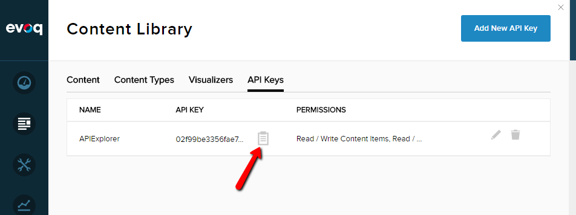
 
This API can be copied and pasted into the app

# Use Cases

We are going to describe several use cases that a developer can test, to view how the Liquid Content API works.

## Get a list of content types

**Steps**

1. Enter the obtained API Key
2. Leave all options as default. Note that by default it is configured to perform a **GET** request to the **ContentTypes** controller, without any additional parameter.
3. Click the request button

**Result**

If the API Key is set up correctly, you can see the request executed successfully.

1. Response status 200 appears in green in the status bar at the bottom 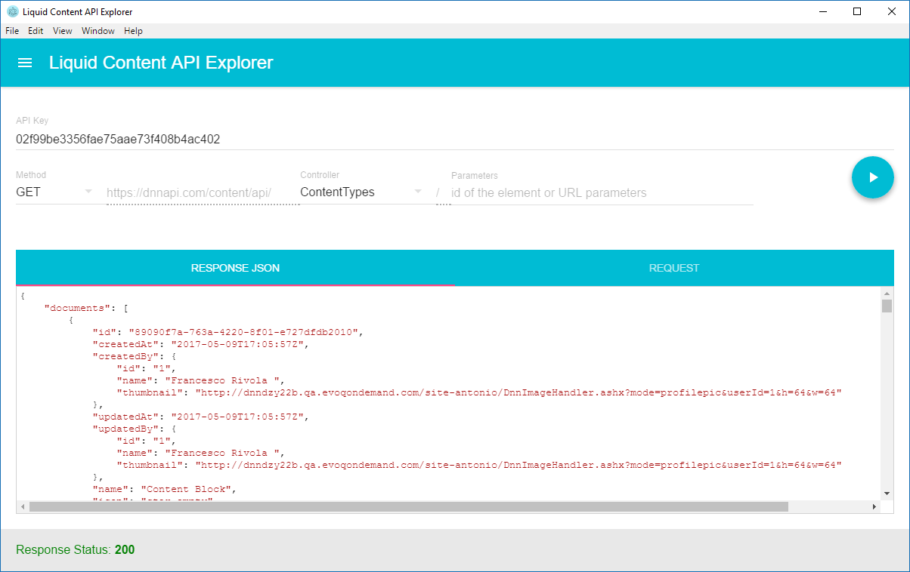
2. The RESPONSE JSON tab shows the returned list of types
    1. If you are in a fresh install, here you can see you have the default 4 system types: Content Block, Department, Job Posting and Person. Also note the **_totalResultCount_**  field with a value of 4
3. The REQUEST tab show the raw http request sent to the server. This can be used to debug, by comparing this against the requests your API client is sending. 
    1. Note how the URL is formed from the input parameters
    2. Note how the Authorization header is formed from the API Key

## Invalid API Key

What would happen if the specified API key is not correct?

**Steps**

1. Modify the API Key, for example, change the last character to a different one
2. Click the request button

**Result**

As expected, the request failed.

1. Note the red message 401 in the status bar at the bottom
2. By inspecting the response in the RESPONSE JSON tab, you can see that the response failed due to authorization problems

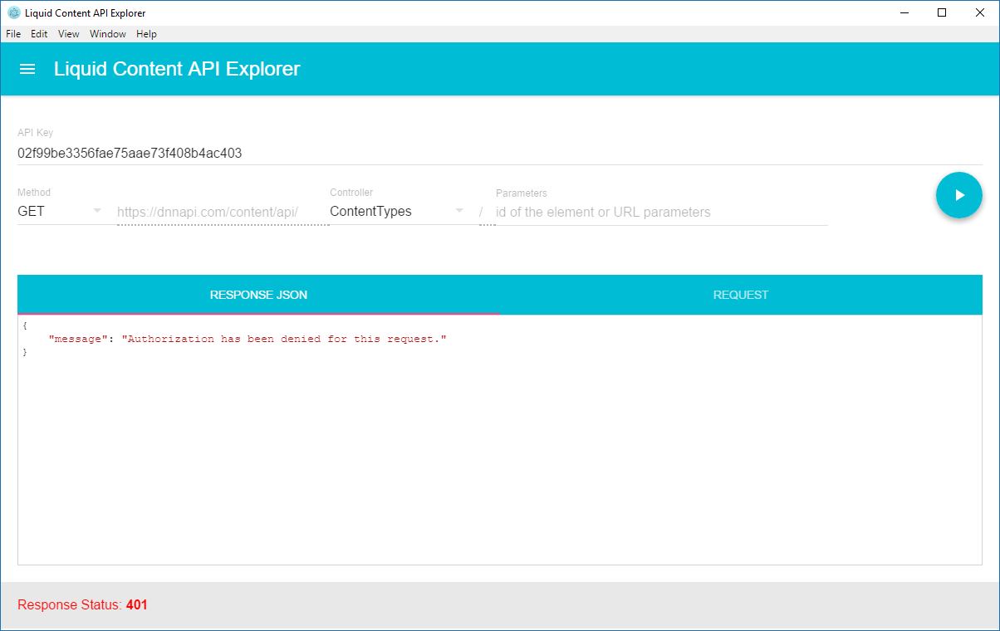

You can use this to view how this kind of error is returned from the API, in order to handle it correctly in your implementation.

## Retrieve a page of 2 Content Types

We can specify parameters to narrow down the list of Content types we are retrieving. For this we need to add additional parameters to the query. If the names and format of the parameters is not known by you, you can chose an example query from the examples palette.

**Steps**

1. Click the menu icon at the top left to expand the examples palette 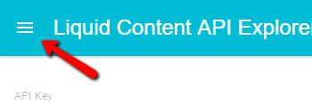
2. Choose &quot;Paginated Content Types&quot; option 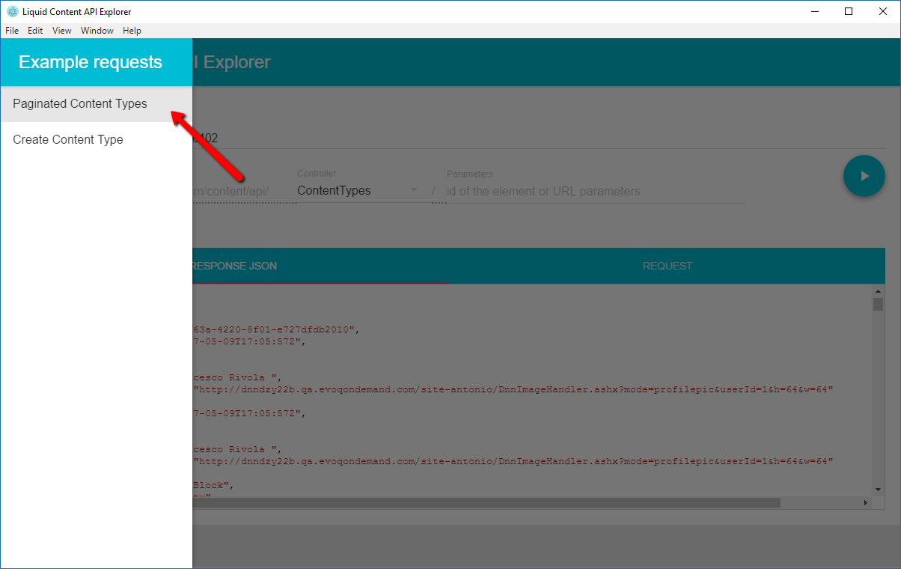
3. Note the Parameters field has been filled up with the query parameters 
    1. Also note that an exclamation mark (?) appears to indicate that you are adding parameters to the request
4. Change the parameters to _startIndex=2&amp;maxItems=2_ to retrieve 2 types from the (0 based) position 2
5. Click the request button

**Result**

1. Green response status 200 in the status bar
2. A response similar to the previous one, but limited to the 2 content types

## Retrieve a specific Content Type

Let&#39;s retrieve a Content Type. For this we need to know its id. To obtain it, search for the &quot;Person&quot; type in the previous response, and copy the id field associated to this type. Note that it should be a GUID.

 

**Steps**

1. Paste the id in the Parameters field
  1. Note that the exclamation mark (?) changed to a slash (/), to indicate that is a id, and it will be sent as part of the URL instead of a parameter
2. Click the request button

**Result**

1. Green response status 200 in the status bar
2. The response JSON shows only the type that matches the id 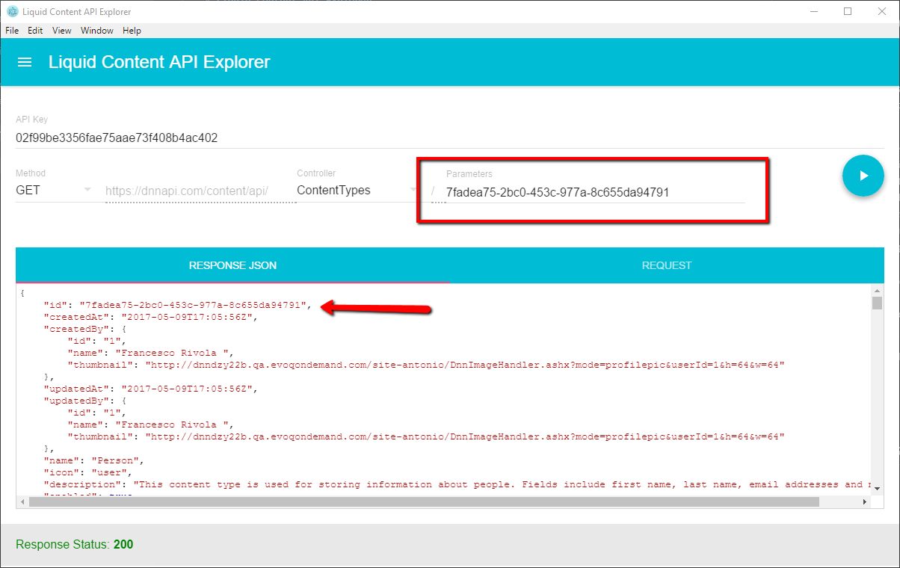

## Try to retrieve an invalid Content Type

Now we are going to check what happens when we try to retrieve a content type using an invalid id.

**Steps**

1. Input an invalid GUID in the Parameters field, for example by changing the last character from the previous example
  1. Note that the value must be a well formed GUID, but should not match with an existing content type
2. Click the request button

**Result**

As expected, the query will fail with a 404 - Not found error.

1. Note the red response status 404 at the status bar 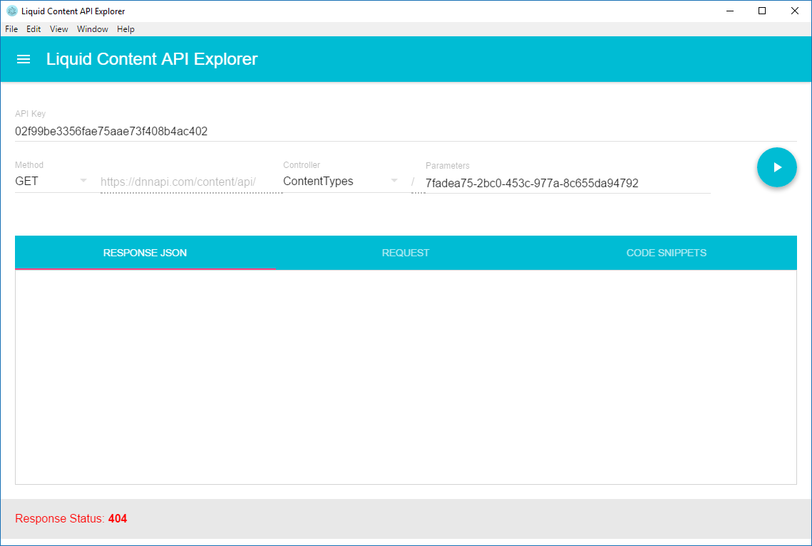

## Create a new Content Type

To create a new content type, we must perform a POST request and specify the definition of the content type as a JSON in the request body.

**Steps**

1. Click the menu icon at the top left to expand the examples palette
2. Click on _Create Content Type_ option 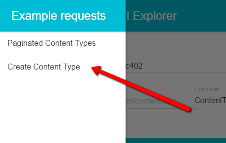
    1. Note the _Method_ field changed to _POST_
    2. Parameters field is not visible
    3. body editor appears, pre-filled with an example JSON to create a content type 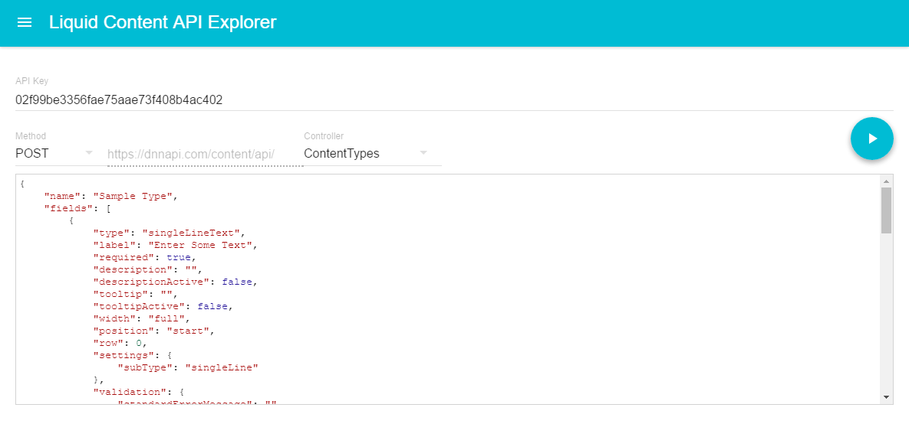
3. Click the request button

**Result**

1. Green Response Status 201 in status bar
2. The RESPONSE JSON Tab shows the created content type, returned by the API
    1. Specifically, the assigned id of the new type can be inspected here 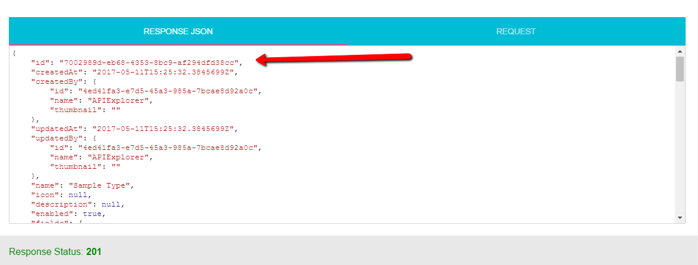
3. Go to the Content Library &gt; Content Types console in Evoq to verify that the new content type appears there 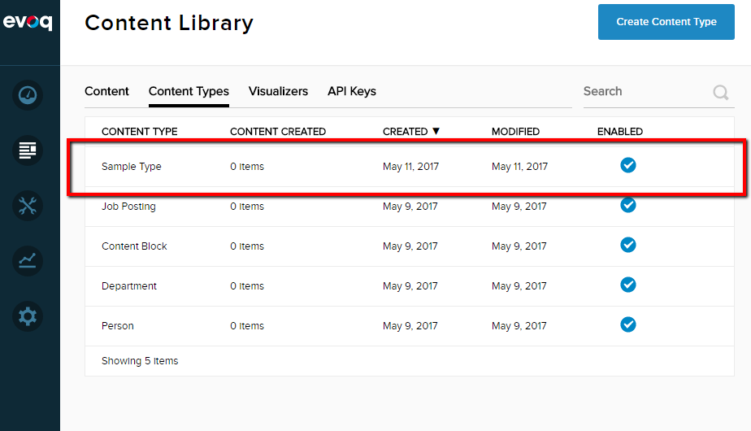

## Try to create a Content Type which name is already in use

Let&#39;s check now what would the response be if the type we are trying to create has some validation errors.

**Steps**

1. Assuming that the example type named &quot;Sample Type&quot; already exists, from the previous use case, load again the &quot;Create Content Type&quot; from the examples palette
2. Click the request button

**Result**

As expected, the request fails with a 422 validation error

1. Note the Response Status 422 (validation error) in the status bar
2. The RESPONSE JSON shows more info with the returned error 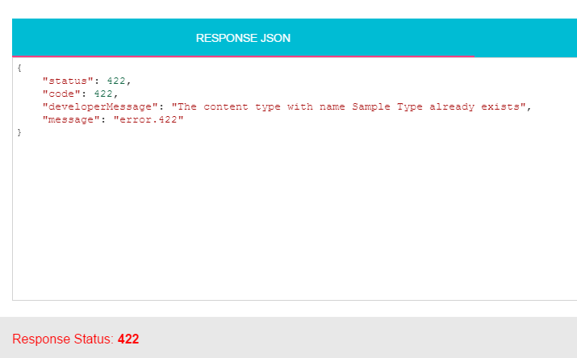
    1. In this case the _developerMessage_ field can be inspected to know that the problem is that the specified name is already in use

## Try to create a Content Type, but your API Key has only read permissions

For this test, we need to create a different API Key, with read only permissions 

**Steps**

1. Paste the new API Key code in the API Key field
2. Click on the top left menu icon and select _Create Content Type_ example
3. Click the request button

**Result**

As expected, the request fails with authentication error

1. Red Response Status 401 in status bar
2. The RESPONSE JSON show the authorization error message 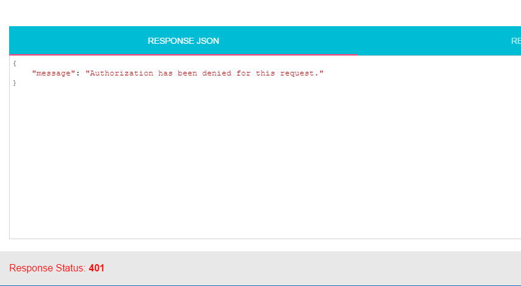

## Update an existing Content Type

Now we are going to update an existing Content Type. In order to do this, we need the id of the type we want to update. We will use the same id of the previously created content type

**Steps**

1.Load the _Update Content Type_ example, by clicking on the top left menu icon and then selecting it 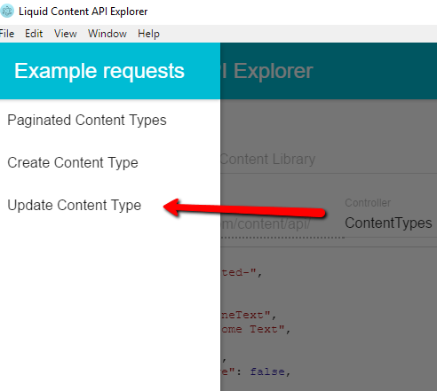
    1. Note the method changed to PUT
    2. Note the name is different
2. Enter the id of the previously created content type 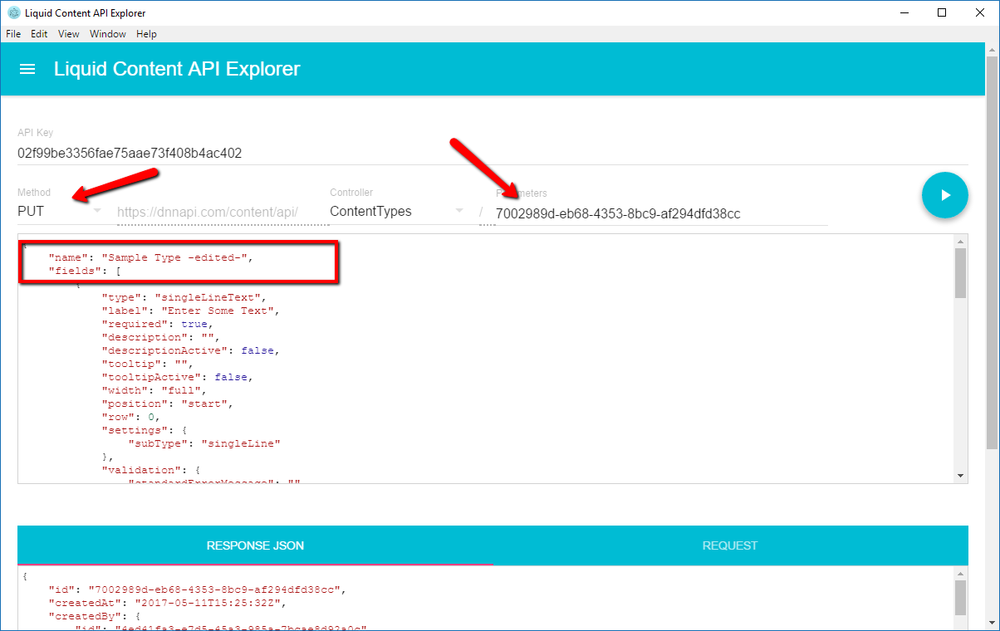
3. Click the request button

**Result**

1. Green Response Status 201 in status bar
2. The RESPONSE JSON Tab shows the updated content type, returned by the API 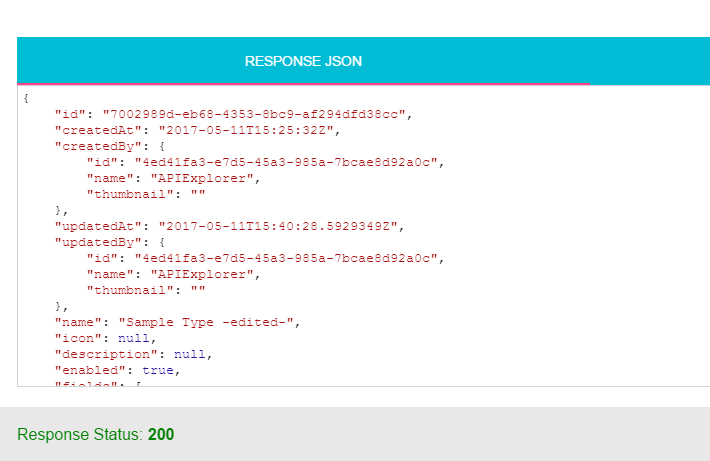
    1. Note the updated name
3. Go to the Content Library &gt; Content Types console in Evoq to verify that the Content Type has been updated correctly 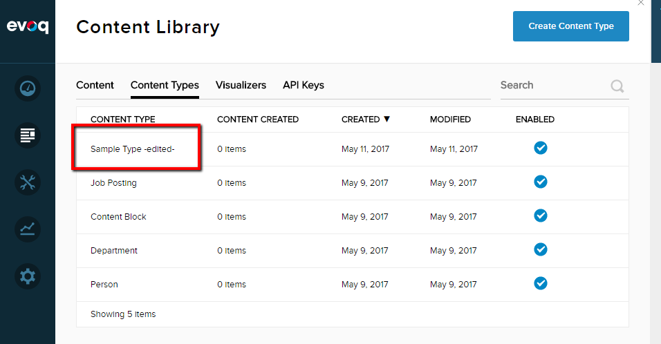

## Try to edit a non-existing Content Type

This time, we are going to check the error returned when we send a request to update an invalid type

**Steps**

1. Load the _Update Content Type_ example, by clicking on the top left menu icon and then selecting it
2. Use a well formed GUID but that does not correspond to an existing content type
3. Click the request button

**Result**

As expected, the query will fail with a 404 - Not found error.

1. Note the red response status 404 at the status bar 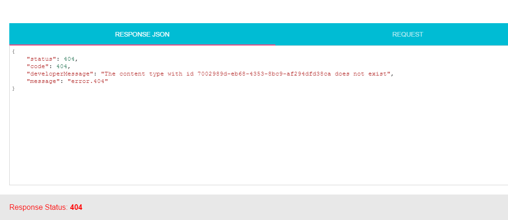
2. By inspecting the returned JSON, the _developerMessage_ field indicates that that type with the specified id does not exist

## Delete a Content Type

Now we are going to delete the previously created Content Type.

**Steps**

1. Change the _method_ field to DELETE
2. Enter the id of the content type to delete in the parameters field
3. Click the request button

**Result**

1. Green Response Status 201 in status bar 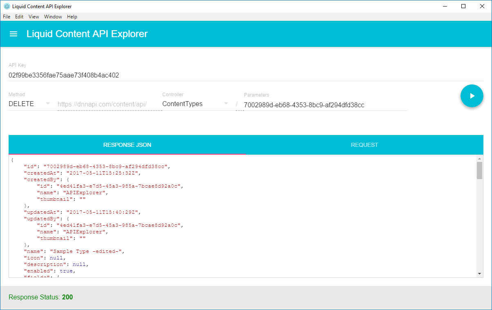
2. The deleted content type is also returned and can be inspected in the RESPONSE JSON tab
3. Go to the Content Library &gt; Content Types console in Evoq to verify that the content type does not appear anymore 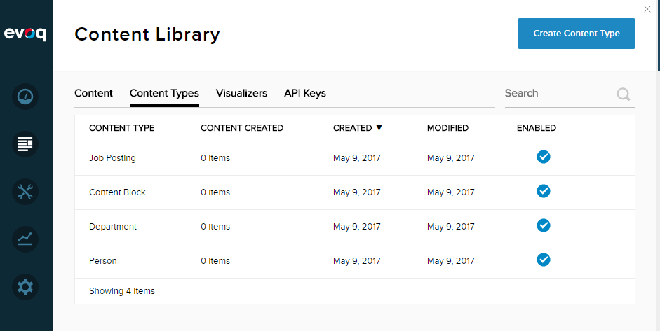

## Try to delete a non-existing Content Type

Let&#39;s check the error returned when we send a request to delete an invalid type.

**Steps**

1. Change the _method_ field to DELETE
2. Use a well formed GUID but that does not correspond to an existing content type
    1. We can use the same request as before, because the item has already been deleted
3. Click the request button

**Result**

As expected, the query will fail with a 404 - Not found error.

1. Note the red response status 404 at the status bar 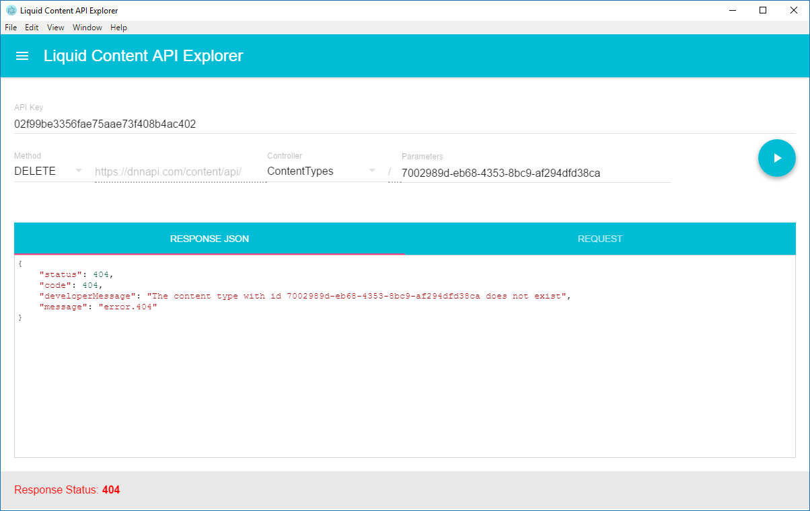
2. By inspecting the returned JSON, the _developerMessage_ field indicates that that type with the specified id does not exist

# Future enhancements

Here are some possible features that could be added to improve app:

- Query string builder:
  - An UI to edit the query string as key/values
  - This could have validation, like only allow the known parameter names, with their corresponding types
- Intellisense in the payload JSON editor
  - It will know the schema of the JSON to be formed
  - Validation could be added
- Validation of the request
  - Errors in the input could be marked, before sending the request
  - The request is allowed anyway, as it must be used to check invalid requests and responses
