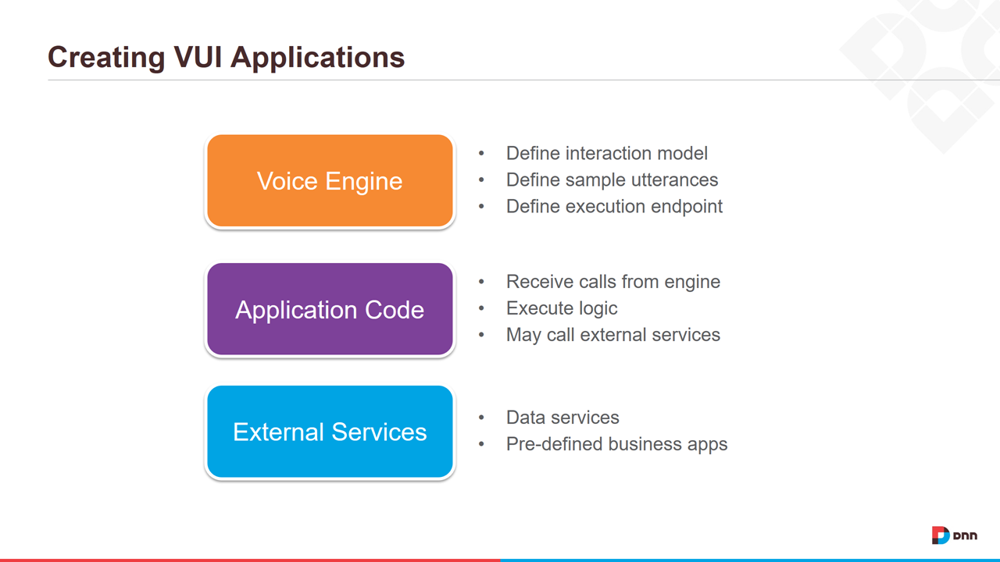

# Amazon Alexa and Liquid Content

# Introduction

In 2015 Amazon launched the Amazon Echo device featuring Alexa, Amazon's attempt at a personal digital assistant.  The Echo was the first in a new breed of hardware devices that allows users to engage in a spoken conversation with a computer. While still somewhat simplistic in capability, the Echo has generated significant public interest, and prompted Google, Microsoft and Apple to create competing devices.

The 1980s ushered in the era of Graphical User Interfaces for computers.  The early 2000s, saw the introduction of Touch Interfaces on both hand-held and desktop devices.  The launch of the Echo marks the beginning of a new era of Voice User Interfaces. With these devices we are literally seeing science fiction becoming reality.

# Amazon Alexa Skills
Amazon's Alexa is following the same path as the iPhone and the PC in cementing it's leadership position in this new era of computing. The Alexa platform features a growing collection of voice enabled applications, called Alexa Skills, that can be enabled for your Alexa devices. Amazon currently has a catalog of just over 10,000 skills that are available for you to install and use with your Alexa devices.

In exploring how to create an Alexa Skill I wondered what it would take to voice enable an Evoq website. Customers today spend a lot of time and money to generate and maintain great content for their websites. Customers continue to look for ways to maximize returns on their content investments. One of the ways that website owners are increasing the value of content is by re-purposing content for multiple channels.  With just a little effort structured content can be repackaged into formats that are most appropriate for a given channel.

Evoq 9.1 introduced a new public API for reading and writing content stored as [Liquid Content](http://www.dnnsoftware.com/cms-features/about-liquid-content). Liquid Content is a cloud based structured content system that we launched with Evoq 9.0. Liquid Content not only allows content managers to easily create great looking websites, but it also allows them to publish that same content to their social media channels, to embed that content on other sites using embed codes, and to make that content available to other applications through the Liquid Content API.

In this article I'll show you how to build an Alexa skill that accesses content from a sample conference website called Liquid Summit.

# Getting Started

## Prerequisites

To follow the tutorial, you will need the following:

* An Evoq 9.1 site with Liquid Content enabled

  **NOTE:** You can generally follow most of this tutorial with any webservices enabled site. 

* An Amazon account
* A copy of Visual Studio 2015 or 2017
* AWS Toolkit for Visual Studio
  - [AWS Toolkit for VS 2015](https://aws.amazon.com/visualstudio/)
  - [AWS Toolkit for VS 2017](https://marketplace.visualstudio.com/items?itemName=AmazonWebServices.AWSToolkitforVisualStudio2017)

## Creating VUI Applications
Alexa Skills (and most VUI Applications) are generally composed of three major components as shown below.

The voice engine for Alexa skills is configured using the [Alexa Skills Kit](https://developer.amazon.com/edw/home.html#/skills). For this tutorial we will host our application code on [AWS Lambda](https://aws.amazon.com/lambda/), and use the AWS Toolkit for Visual Studio to create our code in C#. Finally, we will use Liquid Content for managing the structured content that we'll use for our Alexa Skill.

# Section Index
1. [Creating the Liquid Summit Website](docs/1_Setup_Liquid_Content.md)
2. [Creating the AWS Lambda Project](docs/2_Create_AWS_Lambda_Project.md)

   1. [Building the Basic Alexa Framework](docs/2-1_Create_Basic_Framework.md)
   2. [Building the Application Logic for Alexa](docs/2-2_Create_Application_Logic.md)
   3. [Using the Liquid Content API](docs/2-3_Use_Liquid_Content_API.md)
   4. [Publishing to AWS](docs/2-4_Publishing_Lambda.md)
   5. [Testing and Troubleshooting](docs/2-5_Testing_Lambda_Function.md)

3. [Configuring the Alexa Skill](docs/3_Configure_Alexa_Skill.md)