# Section Index
1. [Creating the Liquid Summit Website](1_Setup_Liquid_Content.md)
2. [Creating the AWS Lambda Project](2_Create_AWS_Lambda_Project.md)

   1. [Building the Basic Alexa Framework](2-1_Create_Basic_Framework.md)
   2. [Building the Application Logic for Alexa](2-2_Create_Application_Logic.md)
   3. [Using the Liquid Content API](2-3_Use_Liquid_Content_API.md)
   4. [Publishing to AWS](2-4_Publishing_Lambda.md)
   5. [Testing and Troubleshooting](2-5_Testing_Lambda_Function.md)

3. [Configuring the Alexa Skill](3_Configure_Alexa_Skill.md)

# Publishing Your Code to AWS Lambda

Now that the code is complete we need to publish it to AWS. There are two different ways to get your code published: 1) package the code locally and upload the package through the AWS Console 2) Use the AWS Toolkit to package and publish your code from within Visual Studio.  For this demo, I'll cover using the AWS Toolkit for publishing your code.

## Create an AWS User

In order to publish to AWS you will need to setup an AWS Profile in Visual Studio. You could use your standard AWS credentials to create an access key, but Amazon recommends that you create a separate user that has limited AWS permissions.

1. Open the AWS developer console and navigate to the [IAM User Management](https://console.aws.amazon.com/iam/home#/users) page.

    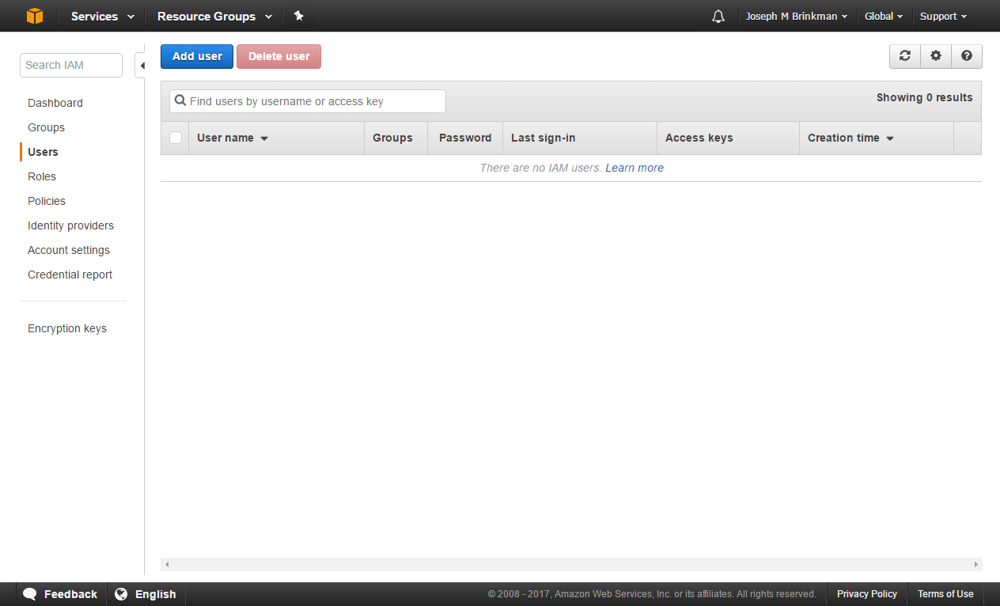

2. Click on the _Add User_ button to open the user creation wizard

3. Enter a user name and select the _Programmatic access_ option. Click _Next: Permissions_ when done

    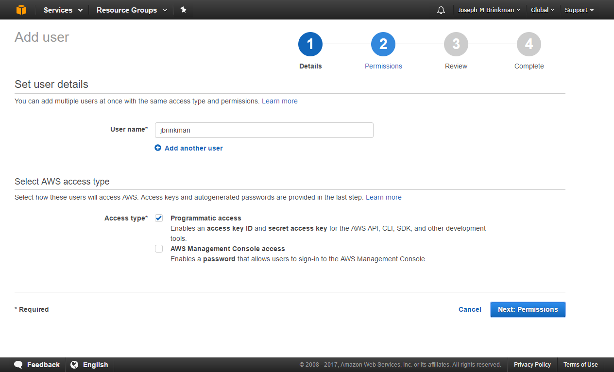

4. Click on _Create Group_ to add a new permission group

    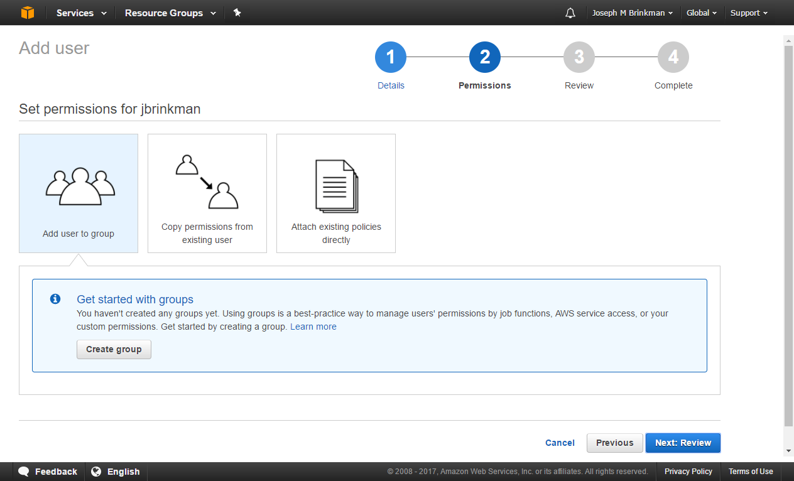

5. Search for "LambdaFull" which should return the _AWSLambdaFullAccess_ policy. Select the policy and click the _Create Group_ button

    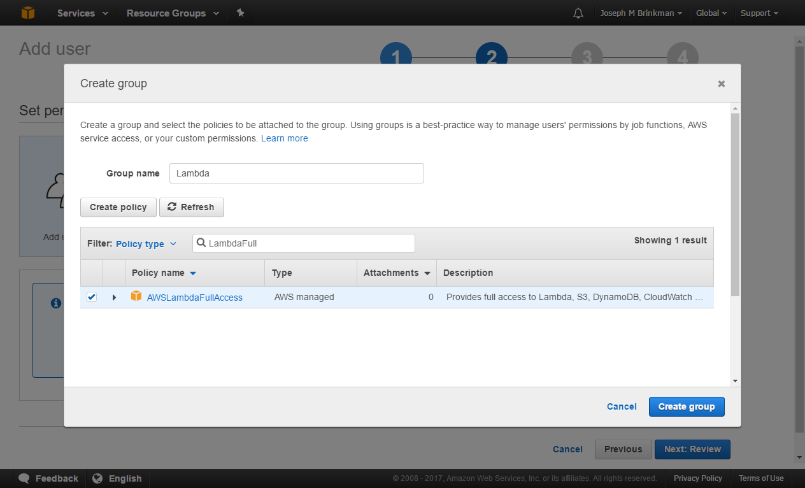

   The AWSLambdaFullAccess policy provides full access to [CloudWatch](https://aws.amazon.com/cloudwatch/?nc2=h_m1), [DynamoDB](https://aws.amazon.com/dynamodb/?nc2=h_m1), Lambda, [S3](https://aws.amazon.com/s3/?nc2=h_m1) and [X-Ray](https://aws.amazon.com/xray/?nc2=h_m1) services.

6. You should see the newly created group in your group list.  Select the group you just created and click the _Next: Review_ button.

    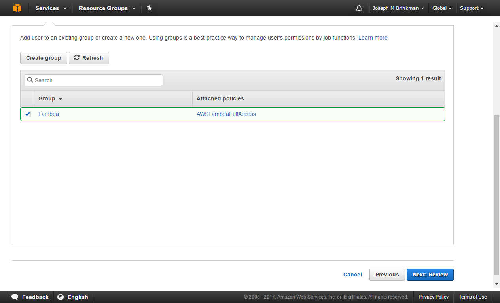

7. Review your choices and if everything looks correct, press the _Create User_ button

    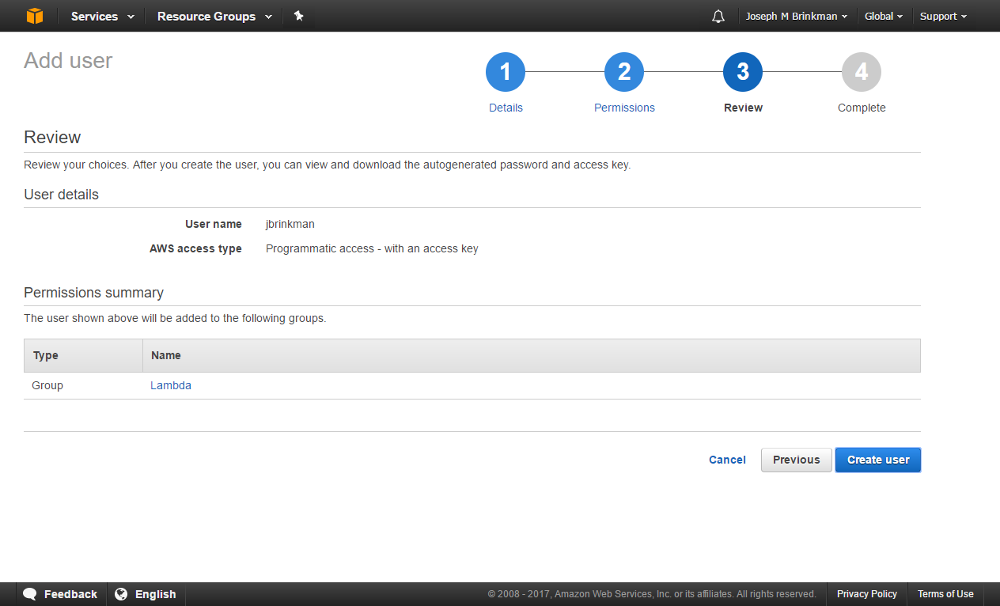

8. You now have a new user with an Access Key ID and Secret Access Key.

    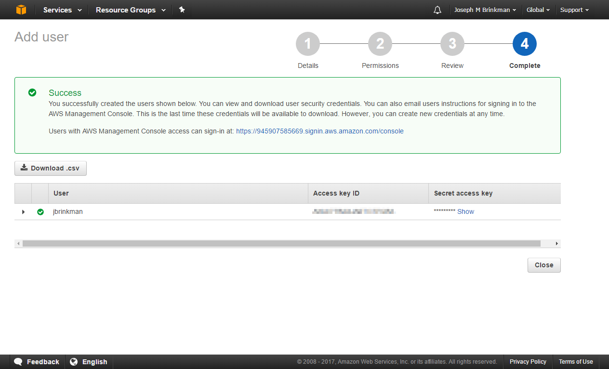

Now that we have our credentials for an account with limited access, we can configure Visual Studio.

## Configure Your AWS Profile in Visual Studio

The AWS Toolkit for Visual Studio includes the ability to use mutiple profiles for accessing AWS resources. To begin the publishing process, we'll need to configure the newly created profile.

1. Open the AWS Explorer

    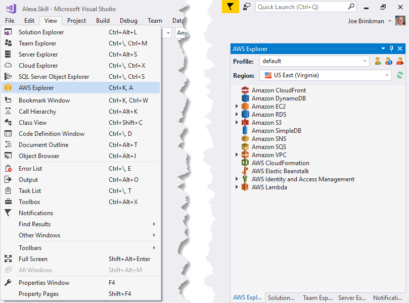

2. Click the _New Account Profile_ button in AWS Explorer and enter the credentials you created above

    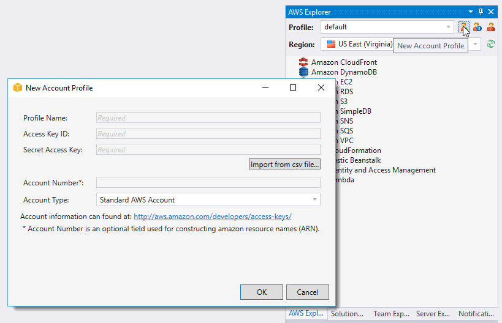

You can now use the newly configured profile to access your AWS resources.

## Publish to AWS 

Now that we have a valid AWS profile configured, we are ready to publish our code to AWS Lambda.

1. Right-click on the project in Visual Studio Solution Explorer and select **Publish to AWS Lambda**

    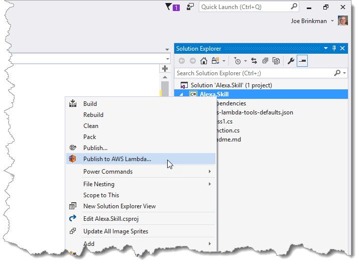

2. In the _Upload Lambda Function_ dialog, select the profile you created previously and the region where you want your function located. Enter the name of your function, select the checkbox to save your settings and click _Next_

    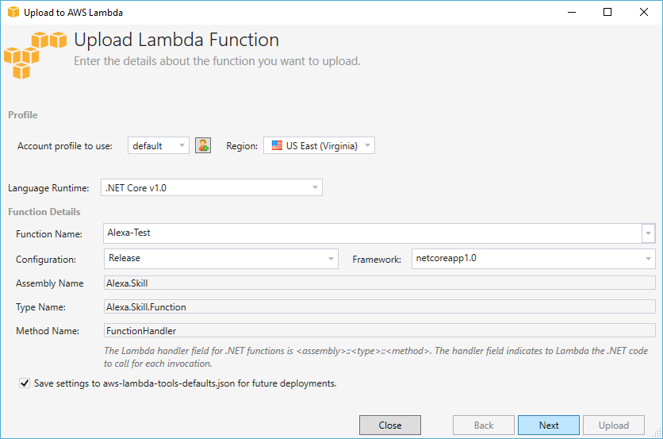

   Selecting the _save settings_ checkbox will store all of your choices to a json file. This file will be used to prepopulate the wizard on any subsequent deployments. 

3. In the second page of the publishing wizard, configure the security role, memory size, VPC and environment variables.

    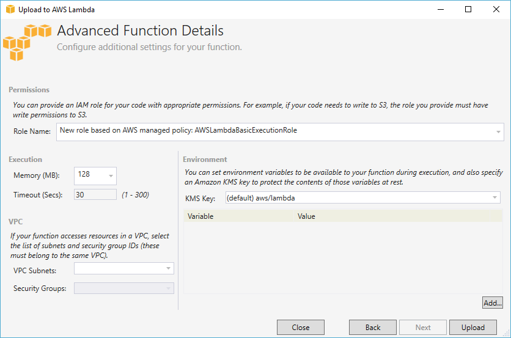

   If you have an existing role with access to AWS Cloudwatch and any other AWS resources required by your application you may use that role. To create a new role, select the base role that you would like to use as the basis for your role.  In my example, I have chosen to base my new role off the AWSLambdaBasicExecution role. This role will give my function access to the CloudWatch API. This is different than the User Group we created earlier which determines what AWS resources can be used from within Visual Studio.

    In the execution settings you should choose the smallest memory footprint that is necessary to execute your code. AWS Lambda is billed based on execution time and memory used. The lower your memory usage, the cheaper it is to use AWS Lambda. Currently, AWS provides 1 million free requests per month and 3.2 million free seconds per month for the 128 (this is the equivelent of running your code for 37 straight days on a single core). For most Alexa applications, this makes AWS Lambda effectively free.

Congratulations! You have now created and published your first AWS Lambda function. However, code development is not done until we can verify that our code is executing correctly. In the next section we'll look at how to test, troubleshoot and debug AWS Lambda functions. 

**Previous:** [Using the Liquid Content API](2-3_Use_Liquid_Content_API.md)

**Next:** [Testing and Troubleshooting](2-5_Testing_Lambda_Function.md)