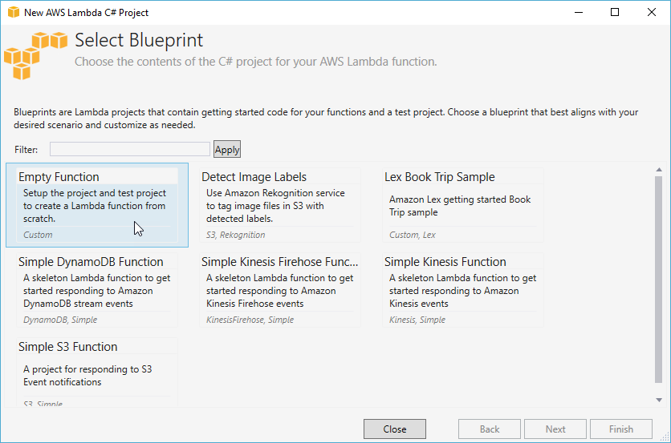
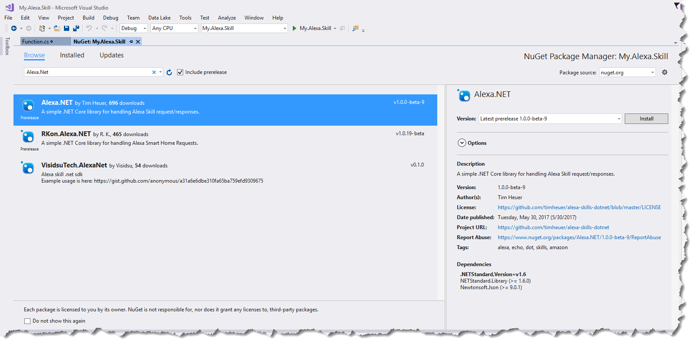

# Section Index
1. [Creating the Liquid Summit Website](docs/1_Setup_Liquid_Content.md)
2. [Creating the AWS Lambda Project](docs/2_Create_AWS_Lambda_Project.md)
3. [Configuring the Alexa Skill](docs/3_Configure_Alexa_Skill.md)

# Creating the Application Code for an Alexa Skill

The Amazon Alexa engine does a great job of understanding spoken language and mapping that into an intent defined by your Skill. What Alexa cannot do though, is determine what should happen as a result of that intent being triggered. That is where your application code comes in. Alexa is very flexible and you can host your application code on any publicly accessible server. For my demo skill, I chose to host my code on AWS Lambda. Since Lambda and Alexa are both Amazon services, they are able provide a few little hooks to make it easier for them to talk to each other. Also, since I'll be running code on AWS Lambda, I'll use AWS CloudWatch to handle my logging needs. 

The application logic is the heart of any Alexa Skill. In this section I'll show you how to create a new AWS Lambda function in C# using the AWS Toolkit for Visual Studio.

# Building the Basic Alexa Framework
## Create a New Project

Building the application logic in C# is pretty straight forward.

1. Open Visual Studio and Create a New Project. Select the AWS Lambda project template. This template will help you get started building code that can run on AWS Lambda, but it does not have any knowledge of Alexa (we'll fix that later).

   

2. Select the _Empty Function_ blueprint and click finish

   

3. The default project includes a single function.cs file along with an AWS Lambda publisher settings file.

    ```C#
    // Assembly attribute to enable the Lambda function's JSON input
    // to be converted into a .NET class.
    [assembly: LambdaSerializer(typeof(JsonSerializer))]

    namespace Alexa.Skill
    {
        public class Function
        {
            public string FunctionHandler(string input, ILambdaContext context)
            {
                return input?.ToUpper();
            }
        }
    }
    ```

At this point you have a fully functioning Lambda function which you can publish to AWS. Of course, we'll need much more than this for our Alexa app.

## Working with Alexa
The default Lambda function does not know anything about Alexa. It is up to you to parse the input, execute your logic and return a result in a format that the Alexa engine understands. To simplify this process we'll use a third party Alexa library which will handle some of the heavy lifting for us.

1. Right click on the project name in the _Solution Explorer_ and choose _Manage Nuget Packages_.
2. Browse for the Alexa.NET package and Install the 1.0.0-beta-9 release.
   
   

   Alexa.NET will add in support for a Request and a Response object which saves you a lot of work with parsing the JSON that Alexa expects.

3. Add Using clauses for Alexa.NET

    ```C#
    using Alexa.NET.Request;
    using Alexa.NET.Response;
    ```
4. Modify the main function to change the type of the input parameter and to change the method return type.

    ```c#
    public SkillResponse FunctionHandler(SkillRequest input, ILambdaContext context)
    {
        return new SkillResponse();
    }
    ```

   When Alexa sends a request to your Lambda function it will look something like this [sample IntentRequest](/src/Lambda.Sample.GetSpeaker.json). 
   
We now have a Lambda function which can actually be used with Alexa. It doesn't do anything so it is not really that useful.

## Handling an Alexa Request

In order to begin processing a request from Alexa, we need to understand what type of request Alexa has made. Alexa will send three (3) [standard request types](https://developer.amazon.com/public/solutions/alexa/alexa-skills-kit/docs/handling-requests-sent-by-alexa#types-of-requests-sent-by-alexa) which all Alexa skills must support: 
* LaunchRequest
* IntentRequest
* SessionEndedRequest

If you skill includes the [Audioplayer Interface](https://developer.amazon.com/public/solutions/alexa/alexa-skills-kit/docs/custom-audioplayer-interface-reference), then you'll also need to handle [AudioPlayer](https://developer.amazon.com/public/solutions/alexa/alexa-skills-kit/docs/custom-audioplayer-interface-reference#requests) and [PlaybackController](https://developer.amazon.com/public/solutions/alexa/alexa-skills-kit/docs/custom-playbackcontroller-interface-reference#requests) requests.

The skill we are building is relatively simple so we just need to worry about handling the Launch, Intent and SessionEnd request types. Let's update the code to handle these three request types.

1. Add methods for the three request types. Each method will use the same method signature so that we can simplify our code.

    ```C#
    private ResponseBody Handler(SkillRequest input)
    {
        return new ResponseBody();
    }
    ```

    In my Code I have added a HandleLaunchRequest, HandleIntentRequest, and HandleSessionEndRequest.

2. Add a dictionary object to the main class to handle mapping request types to each of the function delegates.

    ```C#
    private readonly IDictionary<string, Func<SkillRequest, ResponseBody>> handlers;
    ```

3. Create a constructor and initialize the handlers dictionary.

    ```C#
    public Function() {
        handlers = new Dictionary<string, Func<SkillRequest, ResponseBody>>() {
            { "LaunchRequest", HandleLaunchRequest },
            { "IntentRequest", HandleIntentRequest },
            { "SessionEndedRequest", HandleSessionEndRequest }
        };
    }
    ```

4. Update the main FunctionHandler method that was created as part of the Lambda template. Each of the request handlers returns a ResponseBody which can be used to construct the final SkillResponse.

    ```C#
    public SkillResponse FunctionHandler(SkillRequest input, ILambdaContext context)
    {
        return new SkillResponse()
        {
            Version = "1.0",
            Response = handlers[input.Request.Type](input)
        };
    }
    ```

   The dictionary object that we created earlier makes it easy to directly map a given request type to a specific method used to handle the request. This approach keeps the code neat and avoids the use of a switch statement which can make code more difficult to read and understand.

At this point we have the basic framework that we can use for creating any Alexa skill. Everything from this point forward will focus on dealing with the actual logic of the specific skill we are building.

# Building the Application Logic for Alexa

Earlier we created generic methods for handling the three (3) basic request types. Now it is time to start filling them in with real
