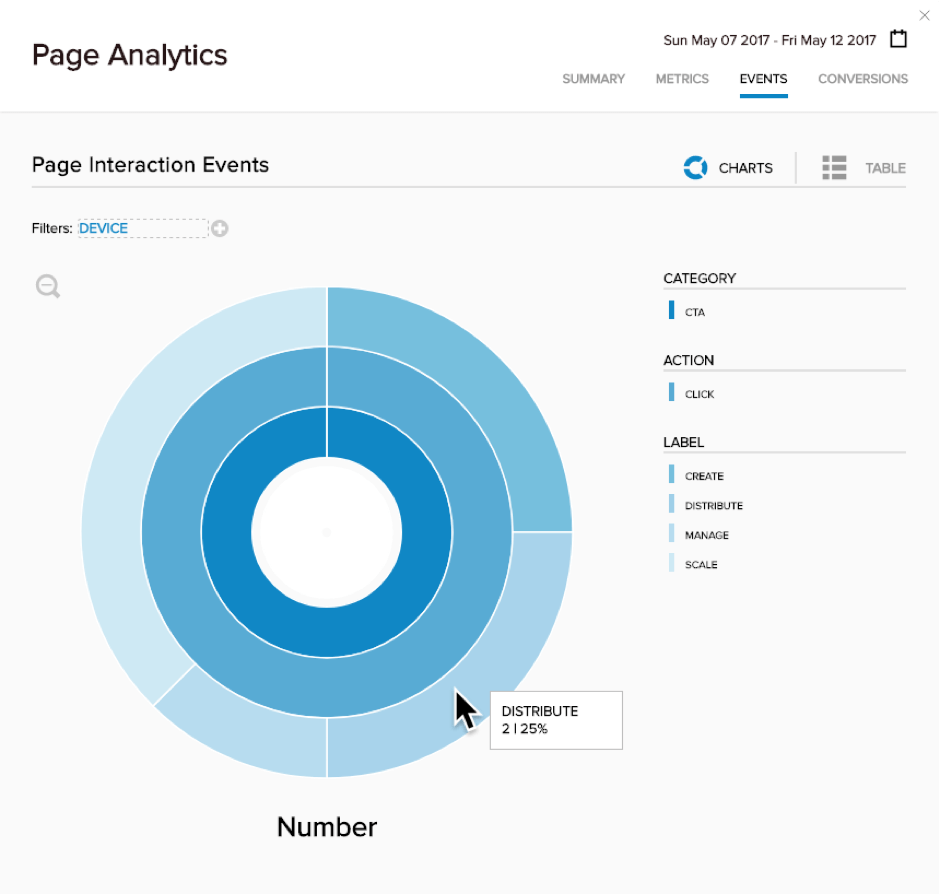

# Measuring Click through of Different Calls to action in an Image Carousel Visualizer

Image Carousels are a popular way of displaying multiple content in the same visual space.  The benefit for the visitor is that it is interesting to look at, particularly for first time visitors.  The benefit for the content owner is that they can feed the visitor a set of different options without the visitor having to scroll through the page.

This type of display is ideal for showing a &#39;Call to Action&#39; (CTA) designed to persuade the visitor to go deeper into the site.  It is perfect for use on the home page of a site to pro-actively show options and turn a passive viewer into someone actively consuming content.

The next best thing to implementing some dynamic content is measure how well it is working.   This makes it easy to identify an underperforming &#39;slide&#39; and replace it with something else.

This tutorial will show you how to build a Carousel visualizer in Liquid Content, wire up Click Events for tracking in Evoq Analytics and quickly and easily understand how engaged your visitors are with that content.  

There&#39;ll be a small amount of Html coding but the rest is just point and click, so sharpen your html pencil and get your clicking finger ready.

# Content Index
1. [Create a New Content Type](docs/step1.md)
2. [Create the Content](docs/step2.md)
3. [Create the Slider Visualizer](docs/step3.md)
4. [Add the Visualizer to a Page](docs/step4.md)
5. [Edit the Visualizer to add Style](docs/step5.md)
6. [Modify your Content Type for multiple images](docs/step6.md)
7. [Modify your Visualizer for multiple images](docs/step7.md)
8. [Edit your Content to add extra images](docs/step8.md)
9. [Add in CTA Link Definitions to the Content Type](docs/step9.md)
10. [Add in CTA Html Attributes to the Visualizer](docs/step10.md)
11. [Add the CTA Link Details to the Content Item](docs/step11.md)
12. [View the Results](docs/step12.md)
13. [Analyze the click behaviour with Analytics](docs/step13.md)

# Summary

This example showcases several aspects of using Evoq:

1. Creating Content Types, Visualizers and Content Items
2. Incorporating open source libraries into visualizers, for the Carousel
3. Using Event tracking to track link clicks in Visualizers
4. Using Evoq Analytics to track and understand the clicks

This can easily be taken further by:
- Adding extra detail to the CTA links, or varying tracking (eg turn the image into a link, and track clicks on the image vs the link to see which is more effective)
- Using different CTAs on the same page, to see if Carousel sliders or blocks of text are preferred
- Decorating all the links on an important page like the home page to see which are the most commonly clicked items