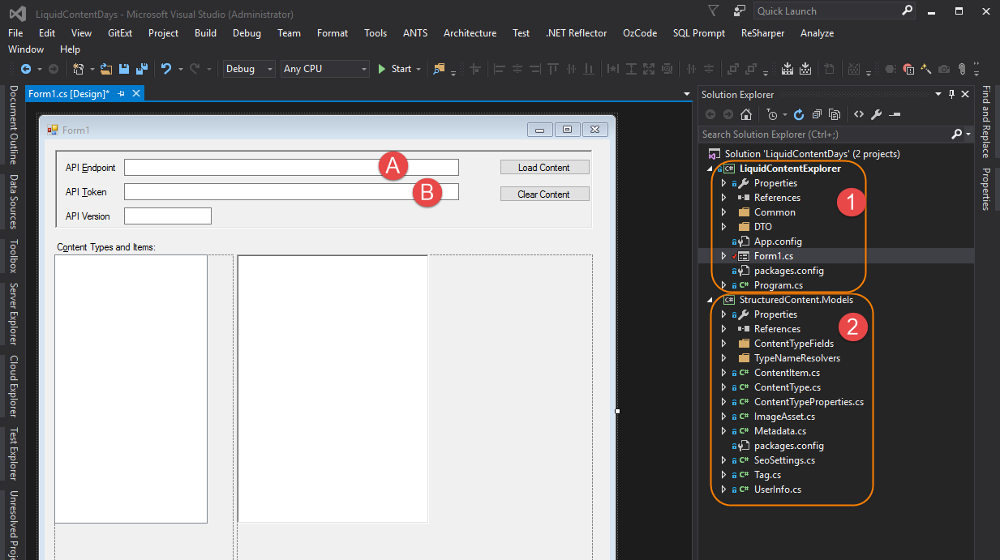
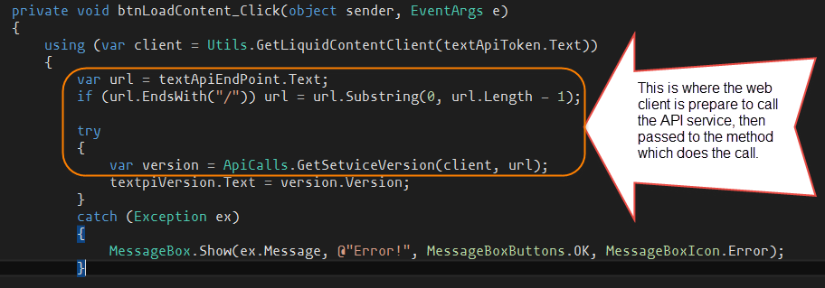

# Liquid Content Explorer

Introduction
-
The purpose of “Liquid Content Explorer” is to let users navigate through their various [Liquid Content](http://www.dnnsoftware.com/cms-features/about-liquid-content) types and items, and view their various sub elements in a Windows Explorer tree like manner.

Technologies Used
-
* Liquid Content APIs from EVOQ
* Windows Forms (desktop app)

Prerequisites
-
* Windows 7 or higher with .NET Framework 4.5.2 or higher
* Visual Studio 2015 Community or higher

Steps
-
1. Compile the applications in VS
2. Copy the Windows Forms executable and all other libraries from the output folder (Debug or release)
3. Run the executable
4. Obtain API Key for Liquid Content and use it to explore your own content types and items

Application details
-
The application uses Windows forms to read and display Liquid Content types and items. When loading the application in Visual Studio you should see a window like this one.

The solution is composed of two projects:
1. Windows Form project (*LiquidContentExplorer**which contains the views and UI
2. The Structured-Content Models project (*StructuredContent.Models*) which contains the .NET classes representing the entities stored in SC

The values for the text boxes (A) and (B) are filled with values obtained from the "App.config" file as in the following image.

When running the application, you will see a window like this (without any data at first).

And when you click the load content (if the values in A and B are valid), the application will do three tasks:
1. Request the API version from the service and display it in the API "Version text" box. The code that achieves this looks like this.

2. Send a request to the service to get the added content types and display them in the tree pane.
3. Send a request to the service to get the added content data records and display them in the tree pane.

Note: that when deserializing the content types in step 2 above, you need to use a  typed conversion deserializer for this to work with all the defined structured content types. The models project contains the necessary converter to be used. Here is an example of how this is done.

**Note:** the sample code contains a *token* that has read-only permission for the data. To be able to insert/update/delete any content, you need to obtain a token with a "write" permission.

Conclusion
-
As can be seen from above, it’s very easy to build an App using EVOQ Liquid Content. All that’s needed is the steps above.
